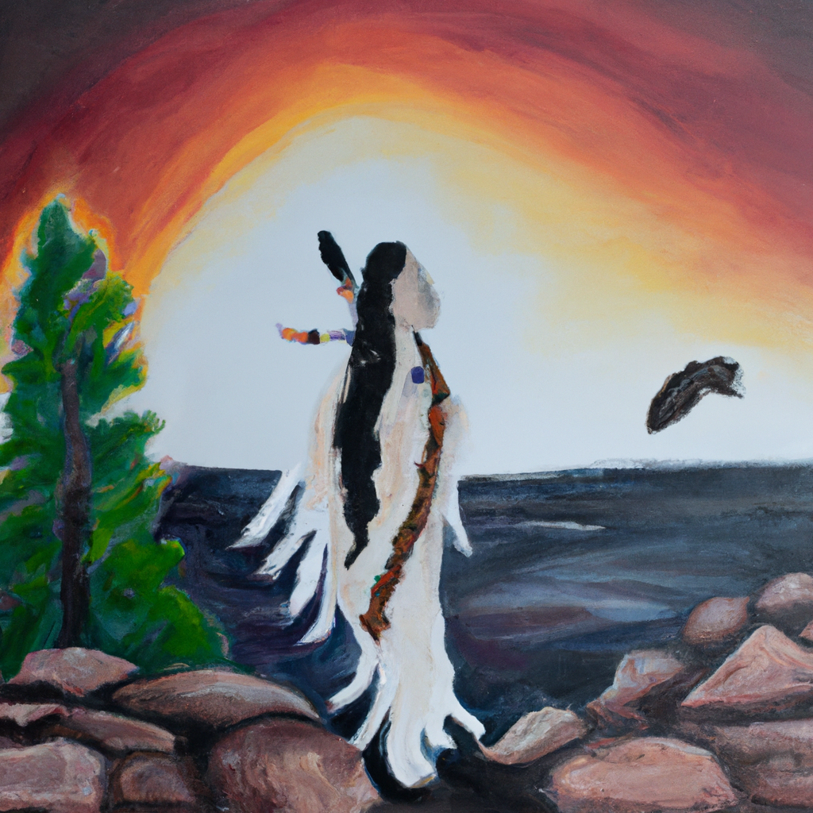

# Lnu-AI: Chat 🪶

  

Lnu-AI is an Artificial Intelligence system developed to serve as a bridge between the Mi'kmaq language and AI. This platform is rooted in the deep commitment to cultural preservation, leveraging modern technologies like machine learning and natural language processing to aid in the revitalization of the Mi'kmaq language.

---

  

---

**Lnu-AI Chat** is a conversational AI system that can be used to chat with an AI system that is trained on the Mi'kmaq language and aligned as an Indigenous AI aligned assistant. This system was pre-trained on a large dataset of written and audion translations of Mi'kmaq words and phrases.

**Lnu-AI Chat** has learned the nuances of the Mi'kmaq language structure, including its orthography and written form.

**Pre-Trained**:
- 8000+ Mi'kmaq Words
- 6000+ Audio Translations
- 150000 Prompt Completion Pairs
- OpenAI Fine-Tune Models

**Output**:
- Embedded Mi'kmaq Language Corpus
- Indigenous Aligned AI Assistant
- Translation and Interpretation into 161 Languages
- Logical Reasoning and Problem Solving
- Storytelling and Poetry
- Coding and Programming

---

## Table of Contents
- [Project Statement](docs/projectstatement.md)

- [Lnu-AI Chat](docs/chat.md)

- [Getting Started](#getting-started)
  - [Prerequisites](#prerequisites)
  - [Installation](#installation)

- [Usage](#usage)
- [Contribution Guidelines](#contribution-guidelines)
- [License](#license)
- [Acknowledgements](#acknowledgements)

---
## Getting Started
### Prerequisites
- Python 3.7+
- pip
- OpenAI API Key

### Installation
1. Clone the repo:

   `git clone https://github.com/AdieLaine/Lnu-AI-Chat.git`

2. Install Python packages:

   `pip install -r requirements.txt`

3. Copy the .env.example file and create a new .env file.
4. Replace "your-openai-key" in the .env file with your actual OpenAI API Key.
5. If required, replace other variables in the .env file based on your configuration.
6. This code also uses Streamlit .streamlit/secrets.toml to store your OpenAI API Key and other sensitive information.

7. Download the Data files from [here](https://drive.google.com/drive/folders/1XvBdEu7kn9vr7bn3eJOUuLPeEK4x-DY4?usp=drive_link) and place them in the data folder.

---

## Usage
1. Ensure you are in the project directory and run: `streamlit run lnu-ai-chat.py`
2. Open the link in your browser:  streamlit run lnu-ai-chat.py
3. After executing the above command, open the link displayed in the terminal in your web browser: Local URL: http://localhost:8501
---

## Contribution Guidelines

We welcome contributions, issues, and feature requests! If you're considering significant changes, kindly open an issue first to discuss what you would like to change.

---

## License
This project is licensed under the terms of the [MIT license](https://github.com/AdieLaine/Lnu-AI-Chat/blob/main/LICENSE).

---

## Acknowledgements
The Lnu-AI project honors the timeless art of storytelling, keeping the flame of tradition alive and preserving the rhythmic beauty of Mi'kmaq words. Lnu-AI is my heartfelt gift to the Mi'kmaq people, a testament to our shared heritage, and a vital step towards a future where technology and tradition intersect gracefully, celebrating and honoring the richness of cultural diversity.

We would like to acknowledge [Mi'gmaq-Mi'kmaq Online](https://mikmaqonline.org/) for consolidating Listuguj Mi'kmaq translations.

Lnu-AI was born at the crossroads of GPT-4 API and the insatiable curiosity to be creative. We extend out thanks to[OpenAI](https://openai.com/) for providing the API solution that was critical in the pre-training and fine-tune process.

---

Developed by [Madie Laine](https://twitter.com/justmadielaine)